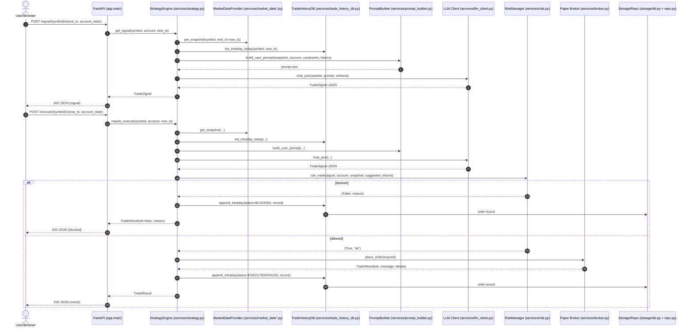
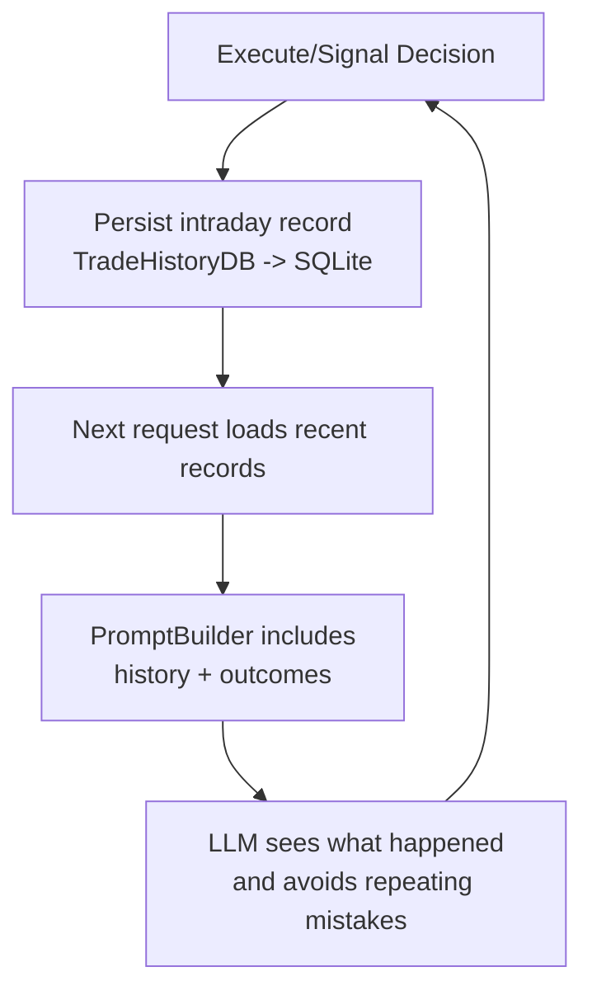

# xtrader

**xtrader** is an intraday quantitative trading assistant for China A-shares powered by LLMs (DeepSeek/Qwen/OpenAI-compatible).
It combines **real-time market data**, **account state**, **risk control**, and **trade history feedback** to generate disciplined trading signals every 30 minutes.

> ⚠️ This project is for **research & paper trading** only.  
> Do NOT use with real capital without extensive testing.

---

## Features

* 🔹 LLM-driven trade decision engine (BUY / SELL / HOLD)
* 🔹 Uses **AkShare (Eastmoney)** real-time & minute bars
* 🔹 Account-aware decisions (cash, position, cost, PnL)
* 🔹 Strict **risk management**
  * max trades per day
  * cooldown
  * confidence threshold
  * max position exposure
* 🔹 Trade history stored in **SQLite**
* 🔹 Paper broker (no real orders)
* 🔹 Backtest UI & API
* 🔹 Direct LLM chat endpoint (structured JSON supported)
* 🔹 Full logging & observability

---

## Architecture

```

xtrader/
│
├── app/
│   ├── main.py                # FastAPI entrypoint
│   ├── config.py              # Settings (.env)
│   ├── logging_config.py
│
│   ├── services/
│   │   ├── strategy.py        # Core trading engine
│   │   ├── prompt_builder.py  # LLM prompt
│   │   ├── market_data.py
│   │   ├── market_data_akshare.py
│   │   ├── risk.py
│   │   ├── broker.py
│   │   ├── llm_client.py
│   │   ├── trade_history_db.py
│   │   └── cache.py
│
│   ├── storage/
│   │   ├── db.py              # Async SQLite
│   │   ├── orm_models.py
│   │   └── repo.py
│
│   ├── models.py
│   └── models_llm.py
│
├── static/
│   ├── signal.html
│   ├── execute.html
│   └── backtest.html
│
├── .env
└── README.md

````

---

## Tech Stack

* **FastAPI**
* **SQLAlchemy (async)**
* **SQLite (production mode, WAL)**
* **AkShare**
* **DeepSeek / OpenAI compatible LLM**
* **Pydantic v2**
* **Python 3.10+**

---

## Installation

```bash
git clone <your_repo>
cd xtrader

python -m venv .venv
source .venv/bin/activate

pip install -r requirements.txt
````

---

## Environment Variables (.env)

```env
# Market
MARKET_PROVIDER=akshare

# LLM
LLM_PROVIDER=deepseek
LLM_API_KEY=sk-xxxx
LLM_BASE_URL=https://api.deepseek.com/v1
LLM_MODEL=deepseek-reasoner

# Risk guardrails
MAX_TRADES_PER_DAY=5
TRADE_COOLDOWN_SECONDS=1200
MAX_POSITION_VALUE_CNY=100000
FIXED_TRADE_AMOUNT_CNY=5000
MIN_CONFIDENCE=0.65

# Database
DATABASE_URL=sqlite+aiosqlite:///./xtrader.db
```

---

## Run

```bash
uvicorn app.main:app --reload --port 8000
```

Open:

* Swagger UI: [http://127.0.0.1:8000/docs](http://127.0.0.1:8000/docs)
* Health check: [http://127.0.0.1:8000/health](http://127.0.0.1:8000/health)

---

## Core Endpoints

### 1) Generate Signal

```http
POST /signal/{symbol}
```

Example:

```json
{
  "now_ts": "2026-01-07 15:00:00",
  "account_state": {
    "cash_cny": 100000,
    "position_shares": 10000,
    "avg_cost_cny": 4.8,
    "unrealized_pnl_cny": -900
  }
}
```

Response:

```json
{
  "action": "HOLD",
  "horizon_minutes": 30,
  "confidence": 0.42,
  "expected_direction": "FLAT",
  "suggested_lots": 0,
  "reason": "...",
  "risk_notes": "..."
}
```

---

### 2) Execute (Paper Trade)

```http
POST /execute/{symbol}
```

* Runs signal
* Applies risk checks
* Places **paper order**
* Stores execution & feedback

---

### 3) Trade History

```http
GET /trade_history/{symbol}
POST /trade_history/{symbol}/clear
```

---

### 4) Stock Bars

```http
GET /api/stock/bars?symbol=000100&start=2026-01-07 09:30:00&end=2026-01-07 15:00:00&freq=5
```

---

### 5) LLM Passthrough

```http
POST /api/llm/chat
```

Supports:

* plain text chat
* JSON schema structured output

---

### 6) Backtest

* UI: `/backtest`
* API:

  * `/api/backtest/run`
  * `/api/backtest/report`

---

## Trading Logic

1. Fetch snapshot (AkShare)
2. Load last N trade history
3. Build structured prompt:

   * OHLCV bars
   * account state
   * constraints
   * recent trade history
4. LLM outputs JSON signal
5. RiskManager validates:

   * trade count
   * cooldown
   * confidence
   * exposure
   * cash / position
6. Broker executes paper trade
7. Persist feedback to DB

---

## Risk Controls

* Max trades per day
* Cooldown between trades
* Confidence threshold
* Max portfolio exposure
* Lot size enforcement
* Cash / position validation

---

## Logging

All key events are logged:

* signal_start
* snapshot fetch time
* bars count
* LLM latency
* risk blocks
* execution result
* DB persistence errors

Example:

```
signal_done | symbol=000100 action=HOLD conf=0.42 bars=12 hist=3 ms_llm=32000
```

---

## Database

* SQLite (async)
* WAL enabled
* Tables:

  * executions / intraday records (depends on your ORM naming)
  * trade_feedback (optional)
* Auto-created on startup

---

## Safety Notes

* No real broker integration
* LLM decisions are probabilistic
* Always test with paper trading
* Never trust a single model output

---

## Module Relationship Plots

> These diagrams show **how requests flow through xtrader**, and how the **core modules depend on each other**.
> They’re intentionally “high-level” so you can understand the app quickly before reading code.

### 1) Request Flow (Signal & Execute)



**Interpretation (why this diagram matters):**

* `FastAPI (app.main)` is the **I/O boundary**: it parses input and returns JSON.
* `StrategyEngine` is the **brain**: snapshot → history → prompt → LLM → risk gate → broker → persistence.
* `PromptBuilder` creates a **structured, reproducible prompt**, reducing LLM randomness.
* `RiskManager` is the **hard gate**: even if the LLM says BUY/SELL, risk rules can block it.
* `TradeHistoryDB + storage/*` forms the **feedback loop**: every decision is persisted and becomes context for later decisions.

---

### 2) Dependency Graph (How modules use each other)

```mermaid
flowchart LR
    main[app.main (FastAPI routes)]

    strat[services/strategy.py\nStrategyEngine]
    prompt[services/prompt_builder.py]
    risk[services/risk.py\nRiskManager]
    broker[services/broker.py\nPaper Broker]
    mkt[services/market_data.py\nMarketDataProvider]
    ak[services/market_data_akshare.py\nAkShare impl]
    llm[services/llm_client.py\nOpenAI-compat client]
    th[services/trade_history_db.py\nTradeHistoryDB]
    cache[services/cache.py]

    repo[storage/repo.py]
    db[storage/db.py\nAsync SQLAlchemy]
    orm[storage/orm_models.py]

    models[app/models.py\nPydantic models]
    modelsllm[app/models_llm.py\nLLM schema models]
    cfg[app/config.py\n.env settings]
    log[app/logging_config.py]

    main --> strat

    strat --> mkt
    mkt --> ak

    strat --> th
    th --> repo
    repo --> db
    repo --> orm

    strat --> prompt
    prompt --> models

    strat --> llm
    llm --> cfg

    strat --> risk
    risk --> cfg

    strat --> broker

    strat --> models
    llm --> modelsllm
    prompt --> modelsllm

    main --> cfg
    main --> log

    mkt -. optional .-> cache
    th -. optional .-> cache
```

**Interpretation (how to read this graph):**

* Everything starts at `app.main` (routes) and hands off to `StrategyEngine`.
* `services/*` are the **business logic layer**:

  * Market side: `market_data.py` (interface) → `market_data_akshare.py` (implementation)
  * LLM side: `prompt_builder.py` → `llm_client.py`
  * Control side: `risk.py` and `broker.py`
  * Memory side: `trade_history_db.py` → `storage/*`
* `storage/*` is an **implementation detail** behind trade history:

  * `repo.py` runs queries
  * `db.py` manages engine/session
  * `orm_models.py` defines tables
* `models.py / models_llm.py` define **validated contracts** between modules.

---

### 3) Feedback Loop (Why history improves decisions)



**Interpretation (the “learning without training” idea):**

* This is not model fine-tuning.
* It’s **contextual learning**: the LLM is guided by your own recent actions & outcomes stored in SQLite.

---

## Roadmap

* [ ] Real broker API
* [ ] Multi-symbol portfolio
* [ ] Reinforcement learning feedback loop
* [ ] Strategy ensembles
* [ ] Web dashboard
* [ ] Live PnL tracking
* [ ] Alert system

---
